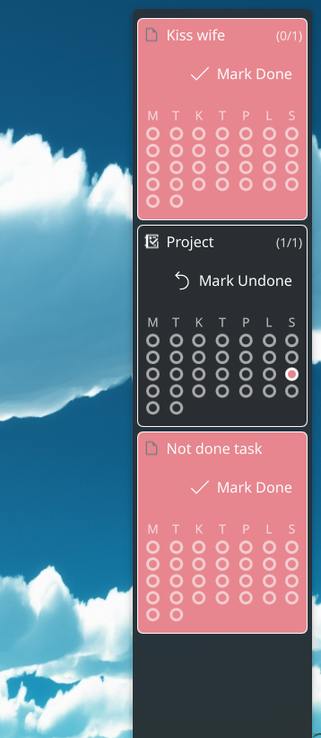

# Daily Task Tracker — KDE Plasma 6 Widget

This widget tracks a single recurring task with a daily check‑in and streaks. Add multiple widgets to track multiple tasks.

I got the inspiration from a fellow developer on discord who made a tool for macos, who also got their inspiration from Simone Giertz, who again likely got their inspiration from someone.

## Features
- Single task configurable in settings
- One‑click “Mark Done” per day, with Undo (localized)
- Streaks: shows `current/best` and updates automatically
- Compact monthly calendar with circular day indicators
  - Localized weekday header, respects locale first day of week
  - Display‑only history (today’s Done/Undo updates the calendar)
- Reminder color when not done (toggle in settings)
- Dynamic sizing by panel orientation
  - Horizontal panel: configurable width (px)
  - Vertical panel: configurable height (px)
- Midnight rollover logic (local time)

## Scripted deploy
Run: `bash scripts/deploy.sh`
- Installs or updates directly from the source directory (no archive).
- Requires: `kpackagetool6` (optional: `qmllint`)

## Install (local user)
- Ensure KDE Plasma 6 is installed.
- From this directory, install the plasmoid package: `kpackagetool6 --type Plasma/Applet -i .`

## Update
To update after changes, run: `kpackagetool6 --type Plasma/Applet -u .` Then restart Plasma shell or re-add the widget.

## Remove
Run `kpackagetool6 --type Plasma/Applet -r org.mercenary-software.daily-task`

## Notes
- State is stored in the widget’s configuration (`lastDoneDate`, `completedDates`, `currentStreak`, `bestStreak`).
- Date keys are stored as local `YYYY‑MM‑DD`.
- Plasma 6 only. If you see log lines from built‑in tabs (Shortcuts/About) claiming cfg_* properties don’t exist, these are harmless and can be ignored.
- Multiple tasks: add multiple instances of the widget, each with its own config and history.

## License
MIT — see LICENSE.
